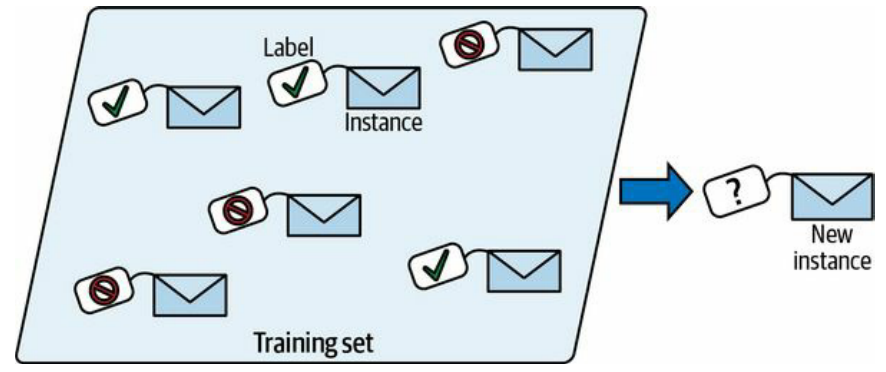

# Tipos de Sistemas de Machine Learning

## 📊 Clasificación Principal

Los sistemas de ML se clasifican según **tres criterios principales**:

1. **Supervisión humana**: supervised, unsupervised, semisupervised, reinforcement learning
2. **Aprendizaje incremental**: online vs batch
3. **Estrategia de generalización**: instance-based vs model-based learning

---

## 🏷️ Supervised vs Unsupervised

### 🎓 Aprendizaje Supervisado

Los datos de entrenamiento incluyen la solución denominada **"label"**.

  
  
<em>Un buen ejemplo de aprendizaje supervisado es la clasificación del spam en el correo electrónico. El aprendizaje supervisado se caracteriza porque todo el conjunto de datos que usas para entrenar un modelo está etiquetado, cada muestra contiene información sobre sí misma, para que el modelo pueda aprender.</em>

#### Tareas Típicas

- **Clasificación** (como filtros de spam)
- **Regresión** (como predecir precios de coches)

> ⚠️ **Nota importante:** Algunos algoritmos de regresión pueden usarse para clasificación y viceversa.

#### Algoritmos Más Importantes

- **k-nearest neighbors**
- **Linear regression**
- **Logistic regression**
- **Support Vector Machines (SVMs)**
- **Decision trees and random forests**
- **Neural networks** (aunque algunas arquitecturas pueden ser no supervisadas o semisupervisadas)

---

### 🔍 Aprendizaje No Supervisado (Unsupervised Learning)

En el aprendizaje no supervisado **no hay etiquetas**, los datos de entrenamiento no están etiquetados y el sistema intenta aprender **"sin un profesor"**.

#### 📦 Clustering

- **K-means**
- **Hierarchical Cluster Analysis (HCA)**
- **Expectation Maximization**

#### 📊 Visualización y Reducción de Dimensionalidad

- **Principal Component Analysis (PCA)**
- **Kernel PCA**
- **Locally-Linear Embedding (LLE)**
- **t-Distributed Stochastic Neighbor Embedding (t-SNE)**

#### 🔗 Association Rule Learning

- **Apriori**
- **Eclat**

> 💡 **Buena práctica:** Siempre es recomendable aplicar reducción de dimensionalidad a los datos de entrenamiento sin perder demasiada información.

---

### 🎯 Aprendizaje Semisupervisado

Algunos algoritmos pueden trabajar con **datasets parcialmente etiquetados**, constituyendo el aprendizaje semisupervisado.

#### Ejemplo Práctico

**Google Photos** agrupa fotos por personas que aparecen en ellas y solicita al usuario que las etiquete.

#### Composición

La mayoría de algoritmos semisupervisados son **combinaciones de algoritmos no supervisados y supervisados**.

#### Deep Belief Networks (DBNs)

Un caso específico son las **Deep Belief Networks (DBNs)**, que se basan en componentes no supervisados llamados **Restricted Boltzmann Machines (RBMs)** apilados.

**Proceso de entrenamiento:**
1. Los RBMs se entrenan secuencialmente de manera no supervisada
2. Todo el sistema se ajusta finamente (fine-tuned) utilizando técnicas de aprendizaje supervisado

---

### 🤖 Aprendizaje por Refuerzo (Reinforcement Learning)

En el aprendizaje por refuerzo, el sistema de aprendizaje se denomina **agente** y puede:

- 👁️ Observar el entorno
- ⚡ Seleccionar y ejecutar acciones
- 🎁 Obtener recompensas a cambio (o penalizaciones en forma de recompensas negativas)

#### Policy

El agente debe aprender por sí mismo cuál es la mejor estrategia, llamada **policy**, para obtener la mayor recompensa a lo largo del tiempo.

---

## 🔄 Batch and Online Learning

### 📋 Criterio de Clasificación

Otro criterio para clasificar los sistemas de ML es si el sistema puede aprender incrementalmente desde el flujo (**stream**) de datos de entrada o no.

Esta distinción establece la diferencia entre:
- **Aprendizaje online**: El modelo puede actualizarse continuamente con nuevos datos
- **Aprendizaje batch**: Requiere entrenar desde cero con todo el conjunto de datos disponible

---

### 📦 Batch Learning (Aprendizaje por Lotes)

En el batch learning, el sistema **no puede aprender incrementalmente** y debe ser reentrenado utilizando todos los datos disponibles.

#### Características

- Se realiza **offline** porque requiere mucho tiempo y recursos computacionales
- Por esta razón se denomina **offline training**
- El proceso puede automatizarse (entrenar, evaluar, lanzar)

#### Limitaciones

> ⚠️ **Problema principal:** El entrenamiento sobre nuevos datos junto con los antiguos puede durar horas, lo que representa una limitación significativa cuando se necesita actualizar el modelo con frecuencia.

---

### 🔄 Online Learning

En el online learning, el modelo se entrena de manera **incremental** alimentándolo con instancias de datos secuenciales individualmente o en pequeños grupos llamados **mini-batches**.

#### Ventajas

- ⚡ Cada paso de aprendizaje es **rápido y económico**
- 🔁 El sistema aprende sobre la marcha con nuevos datos según van llegando
- 💻 Es una buena opción cuando se tienen **recursos limitados**

#### Out-of-Core Learning

Los algoritmos de aprendizaje online también pueden usarse para entrenar sistemas sobre **grandes datasets que no caben en la memoria** de una máquina, proceso conocido como **out-of-core learning**.

#### Learning Rate

Un parámetro importante es el **learning rate**, que determina qué tan rápido se adapta el sistema a los cambios.

#### ⚠️ Desafíos

Uno de los principales retos es evitar que el rendimiento decaiga cuando entran **datos de mala calidad** al sistema.

> 💡 **Solución:** Para minimizar este riesgo, es necesario monitorizar tanto el sistema como su entrada de datos.

---

## 🎯 Instance-Based vs Model-Based Learning

### Objetivo de la Generalización

Otra manera de categorizar sistemas de ML es según **cómo generalizan**, ya que el objetivo final es **predecir correctamente nuevas instancias**.

Existen **dos enfoques principales** de generalización:
- **Instance-based learning**
- **Model-based learning**

Cada uno con estrategias diferentes para hacer predicciones sobre datos no vistos previamente.

---

### 💾 Instance-Based Learning

Posiblemente la forma más trivial de aprendizaje es **aprender de memoria**.

#### Ejemplo: Clasificación de Spam

Por ejemplo, clasificar emails como spam cuando son idénticos a correos ya etiquetados como spam. No es la peor solución, pero ciertamente no es la mejor.

#### Medida de Similitud

Se puede usar una **medida de similitud** para etiquetar correos parecidos al spam.

Una forma básica de similitud en el caso del spam es **contar el número de palabras que tienen en común**.

#### Definición

> 📌 **Instance-based learning:** El sistema aprende los ejemplos de memoria y luego generaliza a nuevos casos usando medidas de similitud.

---

### 🔬 Model-Based Learning

Otra forma de generalizar a partir de un conjunto de ejemplos es **construir un modelo** de esos ejemplos y luego usar dicho modelo para hacer predicciones.

#### Ejemplo: Satisfacción de Vida vs GDP

Si descargamos datos de GDP per cápita de países y el índice de satisfacción de vida:

1. Hacemos un gráfico
2. Observamos una especie de relación lineal
3. Decidimos modelar la satisfacción de vida como una función lineal del GDP per cápita

#### Model Selection

> 📊 **Model Selection:** Hemos seleccionado un modelo lineal de la satisfacción de vida con un solo atributo, el GDP per cápita.

#### Selección de Parámetros

Antes de usar el modelo, debemos seleccionar algunos **parámetros** para la función lineal.

Para elegir estos parámetros, debemos definir una **medida de rendimiento**.

#### Funciones de Evaluación

Podemos definir:

- **Utility function** (o fitness function): mide qué tan **bueno** es el modelo
- **Función de costo**: mide cuán **malo** es

#### Regresión Lineal

Para problemas de **regresión lineal**, se usa típicamente una función de costo que mide la distancia entre:
- La predicción del modelo lineal
- Las muestras de ejemplo

> 🎯 **Objetivo:** Minimizar esta distancia, y aquí es donde el **algoritmo de regresión lineal** entra en escena.
